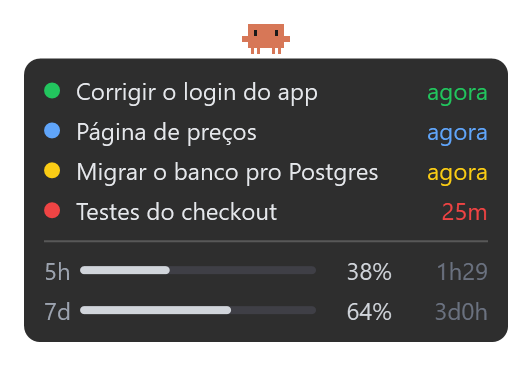
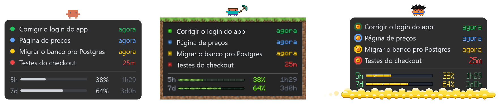

# Claude Monitor

Uma janelinha que fica sempre por cima, no canto da tela, mostrando as suas
sessões do Claude Code e quanto do seu limite você já gastou. Dá pra deixar 3,
4 sessões rodando e ir fazer outra coisa: quando uma termina ou precisa de
você, ela avisa com um som.



**[⬇️ Baixar o ClaudeMonitor.zip](https://github.com/LucasM-Maciel/ticlins-claude-monitor/releases/latest/download/ClaudeMonitor.zip)** (Windows, Mac e Linux no mesmo arquivo)

> Projeto pessoal e não oficial, sem ligação com a Anthropic (Claude), com a
> Mojang (Minecraft) nem com os donos de Dragon Ball e de Star Wars (Lucasfilm).

## O que ela mostra

| Bolinha | Quer dizer |
|---|---|
| 🟢 verde, pulsando | trabalhando |
| 🔴 vermelha | terminou |
| 🔵 azul | te fez uma pergunta |
| 🟡 amarela | pedindo permissão pra rodar algo |

- **O tempo à direita**: há quanto tempo a sessão está assim.
- **5h e 7d**: o mesmo que o `/usage` do Claude Code mostra (o limite de 5
  horas e o da semana), com quanto falta pra renovar. Fica laranja em 80% e
  vermelho em 95%.
- **O Clawd** (o bichinho laranja): anda em volta do cartão quando alguma
  sessão está rodando, pula quando alguém está esperando você e fica parado
  quando está tudo quieto. Andando, de vez em quando ele para e apronta alguma
  coisa, que depende do [tema](#temas).
- **Som**: quando uma sessão termina ou precisa de você, e um som especial
  quando termina a última (tudo pronto). Cada tema tem os seus.
- **Dentro do VS Code**: uma aba "Claude Monitor" na barra lateral com as
  sessões (clique numa pra ir direto nela) e um contador na barra de status.

## Como instalar

Precisa ter:

- **Claude Code** logado com a sua conta do Claude (Pro/Max). O usage não
  aparece se você usa chave de API.
- **VS Code** (ou Cursor).
- **Node.js**, versão LTS: [nodejs.org](https://nodejs.org). É ele que o Claude
  Code usa pra avisar a janelinha.

### Windows

1. [Baixe o ClaudeMonitor.zip](https://github.com/LucasM-Maciel/ticlins-claude-monitor/releases/latest/download/ClaudeMonitor.zip).
2. Botão direito no arquivo > **Extrair tudo**.
3. Dentro da pasta extraída, dê duplo clique em **`instalar-windows.cmd`**.
   Se aparecer "O Windows protegeu o computador", clique em
   **Mais informações > Executar assim mesmo**.
4. Feche e abra o VS Code.

### Mac

1. [Baixe o ClaudeMonitor.zip](https://github.com/LucasM-Maciel/ticlins-claude-monitor/releases/latest/download/ClaudeMonitor.zip)
   e dê duplo clique nele (o Mac extrai sozinho).
2. Abra o **Terminal** (`Cmd + Espaço`, digite *Terminal*, Enter).
3. Digite `bash ` (com um espaço no fim), **arraste o arquivo
   `instalar-mac.sh`** pra dentro da janela do Terminal e aperte Enter.
4. Feche e abra o VS Code.

Na primeira vez, o Mac pode pedir pra instalar as **ferramentas de linha de
comando**. Clique em Instalar, espere terminar (uns minutos) e repita o passo 3.

Se o Mac perguntar se **"security" pode acessar "Claude Code-credentials"**,
clique em **Permitir Sempre**. É só a janelinha lendo o seu usage.

### Linux

1. [Baixe o ClaudeMonitor.zip](https://github.com/LucasM-Maciel/ticlins-claude-monitor/releases/latest/download/ClaudeMonitor.zip)
   e extraia.
2. Abra o terminal dentro da pasta extraída e rode `bash instalar-linux.sh`.
3. Feche e abra o VS Code.

A janelinha usa Python + GTK 3 (já vêm no Ubuntu com GNOME). Se faltar a ponte
com o cairo (`python3-gi-cairo`), o instalador baixa ela sem precisar de root;
se faltar o resto, ele diz o `apt install` certo. Funciona no Xorg e no Wayland
(pelo XWayland). Sem o motor (sem Node), aparece só o cartão, sem o Clawd.

Pronto: a janelinha aparece no canto de baixo à direita. As sessões do Claude
que já estavam abertas precisam ser reabertas pra aparecer; as novas aparecem
sozinhas.

**Pra atualizar**: quando sai versão nova, o VS Code avisa "Claude Monitor X
disponível" com o botão **Baixar**, e a janelinha ganha uma linha roxa "↑ versão X
disponível · baixar" (clique nela). Baixe, extraia e siga o `COMO ATUALIZAR.txt`
que vem no zip (é instalar de novo por cima). Depois o VS Code avisa "Claude
Monitor atualizou" com o botão **Recarregar**: clique quando nenhum Claude
estiver trabalhando nele.

## Como usar

- **Abrir uma sessão**: clique nela e o VS Code abre a aba (ou o terminal) dela.
  Na 1ª vez o VS Code pergunta se deixa a extensão abrir o link: marque pra não
  perguntar de novo. Funciona com o VS Code (com o Cursor, não).
- **Mover**: clique e arraste.
- **Ir pro VS Code**: duplo clique na janelinha.
- **Preferências**: botão direito na janelinha troca o **Tema** (◀ ▶), liga/desliga
  o **Clawd** e muda a **Opacidade** e o **Volume** dos sons. Ficam gravadas pra
  próxima vez.
- **Fechar**: botão direito > Fechar.
- **Reabrir**: no VS Code, `Ctrl+Shift+P` (Mac: `Cmd+Shift+P`) >
  **Claude Monitor: Abrir janelinha flutuante**. No Windows também tem o
  atalho "Claude Monitor" na Área de Trabalho.
- **Desligar a janelinha** e ficar só com a barra lateral: nas configurações
  do VS Code, desmarque **Claude Monitor: Overlay**.

## Temas



Botão direito > **Temas ◀ ▶**. Instalação nova começa no Padrão; quem já usava
a janelinha antes dos temas continua no Minecraft.

- **Padrão**: o Clawd sem ferramenta. Pisa num bug, abre o notebook, toma café,
  pensa, risca a lista de tarefas e faz festa quando acaba tudo. Quando fica
  tudo quieto, ele dorme (com bolha no nariz e sonhos de programador) ou joga
  videogame numa TV de tubo, ganhando ou perdendo (uma vez cada). A cada 15 bugs pisados vem um evento especial, com som:
  **Space Invaders** e **Bug Kaiju**, um de cada vez. Os avisos são um sino.
- **Minecraft**: o Clawd de Steve (às vezes de Alex; bem raro, de Herobrine),
  borda de terra com grama, bolinhas de orbe de XP e o usage na barra de XP.
  Andando, ele enfrenta zumbi, esqueleto, creeper, aranha e outros mobs, ou
  minera; sobe de nível a cada 5 mortes e, a cada 20, enfrenta o **Ender
  Dragon**, com os sons do jogo. Quando fica tudo quieto, ele põe uma cama e
  dorme, ou cava um laguinho e pesca (uma vez cada).
- **Dragon Ball**: o Clawd de quimono, que às vezes se transforma; a nuvem
  voadora, as esferas no lugar das bolinhas e a barra de ki ("MAIS DE 8000!").
  Cada sessão que termina dá uma esfera; na 7ª, o dragão aparece e realiza um
  pedido do Clawd (limite infinito, feijões mágicos, banquete ou código sem
  bugs, um de cada vez). A cada 150 voltas no cartão vem a **lua cheia**: ele
  vira um macaco dourado gigante e volta no Super Saiyajin 4, que dura 2 min.
  Quando fica tudo quieto, ele medita flutuando ou treina (uma vez cada).
- **Star Wars** (feito pelo [gjthec](https://github.com/gjthec)): o Clawd de
  armadura preta, capa e sabre vermelho; moldura de neon, cristais kyber no
  lugar das bolinhas e o usage em sabres de luz que mudam de cor com o gasto
  (violeta, roxo, magenta, vermelho). Andando, ele rebate tiros de blaster, corta um
  droide ao meio, ergue outro com a Força ou só respira fundo; quando fica tudo
  quieto, medita levitando pedras ou monta um sabre no ar (uma vez cada); quando
  acaba tudo, salta pro hiperespaço. A cada 50 voltas no cartão ele **troca de
  lado da Força**: no lado da luz veste o manto, o sabre fica verde e o cartão
  off-white, verde e marrom; mais 50 voltas e ele volta pro lado sombrio. A cada
  30 droides destruídos vem um evento especial, com som, um de cada lado:
  **A Batalha da Frota** (no espaço) e **A Defesa da Floresta**. Os avisos são
  bipes de droide e o sabre acendendo.

As animações precisam do Node.js (que a instalação já pede); sem ele a
janelinha mostra o Clawd simples, sem as cenas.

### Sons e texturas do Minecraft

No tema Minecraft os sons são os do **jogo**: o "hmm" do aldeão quando alguém
espera você, o som de XP quando uma sessão termina e o de **subir de nível**
quando termina a última (nada mais rodando nem esperando você). Os mobs, os
blocos e o dragão também são os do jogo.

O instalador baixa tudo do servidor da Mojang, o mesmo que o launcher do jogo
usa: **não precisa ter o Minecraft nem o ffmpeg**, e nada da Mojang vai no
pacote. Instalou sem internet? A extensão baixa sozinha depois, ou, no VS Code:
`Ctrl+Shift+P` > **Claude Monitor: Usar sons do Minecraft**.

## Deu problema?

**Nenhuma sessão aparece.** Reabra as sessões do Claude (a janelinha só vê as
abertas depois da instalação). Se continuar, confira se o Node.js está
instalado: abra um terminal e rode `node -v`.

**"usage indisponível".** Só aparece se ela nunca conseguiu ler o usage
(depois da 1ª vez, mostra o último que viu). Espere 2 minutos, que ela tenta de novo. Se não
voltar, confira se o Claude Code está logado com a conta do Claude (`/login`),
e não com chave de API.

**A janelinha sumiu.** `Ctrl+Shift+P` > **Claude Monitor: Abrir janelinha
flutuante**. Se ela sumiu sozinha (depois de atualizar, por exemplo), mande o
arquivo `janelinha.log` da pasta `.claude-monitor` (dentro da sua pasta de
usuário) pra quem te passou o Claude Monitor.

**A bolinha está errada** (amarela sem pedir nada, por exemplo). Tire um print
e mande pra quem te passou o Claude Monitor.

## O que ela acessa

Tudo fica no seu computador. A janelinha lê os arquivos que o Claude Code já
grava (`~/.claude`) e usa o seu próprio login pra perguntar o usage ao mesmo
endereço que o `/usage` usa (`api.anthropic.com`). Ela nunca renova nem manda
o seu login pra outro lugar.

A instalação:

- acrescenta 4 hooks no `~/.claude/settings.json` (guarda uma cópia do anterior
  em `settings.json.bak-claude-monitor`);
- cria a pasta `~/.claude-monitor`.

## Desinstalar

1. No VS Code, desinstale a extensão **Claude Monitor**.
2. Apague a pasta `~/.claude-monitor` (Windows: `C:\Users\<você>\.claude-monitor`).
3. No `~/.claude/settings.json`, apague os hooks que citam `.claude-monitor`.

## Pra quem quer mexer no código

```bash
npm ci
npm run empacotar   # monta dist/ClaudeMonitor.zip e o .vsix
npm run testar      # testes da extensão (Node)
powershell -ExecutionPolicy Bypass -File testes/windows/testes.ps1   # Windows
bash testes/mac/testes.sh                                            # Mac
```

- `extensao/`: a extensão do VS Code, com a janelinha em `extensao/janelinha/`
  (Windows: `overlay.ps1`; Mac: `overlay.swift`) e as animações dos temas em
  `extensao/janelinha/motor/` (um programa em Node, igual nos dois:
  [docs/MOTOR.md](docs/MOTOR.md)).
- `instalar/`: os instaladores.
- `testes/cenarios.js`: as situações que a janelinha tem que acertar nos dois
  sistemas.

A cada push, o GitHub testa o pacote num Mac e num Windows de verdade. Uma tag
`v*` publica o .zip na página de download.

PR é bem-vindo: o Volume, a Opacidade e o liga/desliga do Clawd no botão
direito vieram do primeiro, do [@TiagoPortilho](https://github.com/TiagoPortilho) (#1).

## Licença

[MIT](LICENSE): pode usar, copiar e mudar à vontade, sem garantia nenhuma (use
por sua conta). Ficam de fora o `extensao/janelinha/vorbis.min.js`, com as
licenças dele em `vorbis-licencas.txt`, e os sons e texturas do Minecraft, que
são da Mojang e não estão no repositório. Claude é marca da Anthropic.
